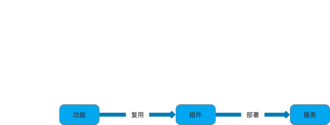

# 1，系统与子系统
## **系统**
泛指由一群有关联的个体组成，根据某种规则运作，能完成个别元件不能单独完成的工作的群体

- 关联：系统是由一群有关联的个体组成，没有关联的个体堆在一起不能成为一个系统。
- 规则：系统内的个体需要按照制定的规则运作，而不是单个个体各自为政。规则规定了系统内个体分工和协作的方式。
- 能力：系统能力与个体能力有本质的差别，系统能力不是个体能力之和，而是产生了新的能力。

## **子系统**
也是由一群有关联的个体所组成的系统，多半会是更大系统中的一部分。子系统的定义和系统定义是一样的，只是观察的角度有差异，一个系统可能是另外一个更大系统的子系统。

# 2，模块、组件、服务

## **模块**
一套一致而互相有紧密关联的软件组织，分别包含了程序和数据结构两个部分，现在软件开发往往利用模块作为合成的单位。

## **组件**
包含可编程的、可重用的、与语言无关的软件单元，组件可以很容易被用于组装应用程序中。

模块和组件都是系统的组成部分，只是从不同的角度拆分系统而已：
- 从**逻辑**的角度来拆分系统后，得到的单元就是**模块**；从**物理**的角度来拆分系统后，得到的单元就是**组件**；
- 划分模块的主要目的是职责分离；划分组件的目的是单元复用；

## **服务**
服务和组件由某种相似之处，他们都将被外部的应用程序使用，两者之间最大的差异在于，组件是在本地使用的（如jar文件），而服务是运行起来的，要通过同步或者异步的远程借口来远程使用（如RESTFUL接口，web service，消息系统，RPC，或者socket）

服务是可以单独运行，并且对外提供功能的一种形式，可以将一个复杂的项目分解成多个服务。当某一个服务挂掉时不会拖垮整个系统，如果没有服务化，每当一个新的功能被添加到系统中就会影响到所有功能；如果采取服务化，每个服务只对其上下游的服务负责。

# 3，软件架构体系

