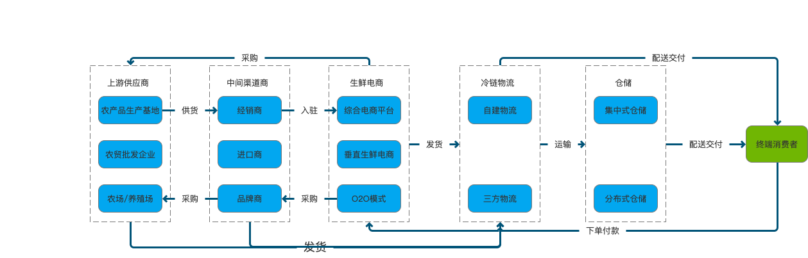
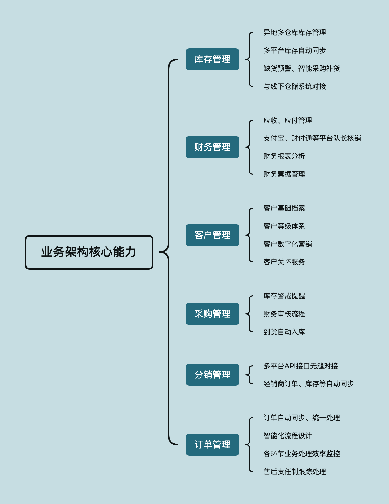
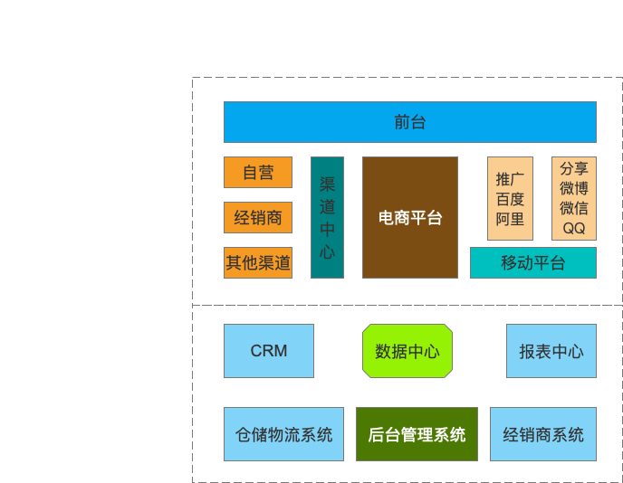
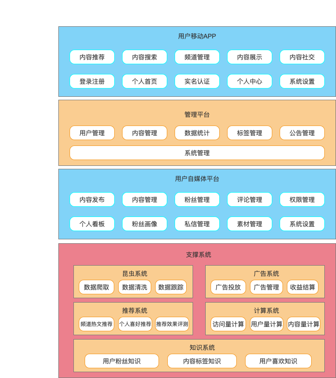
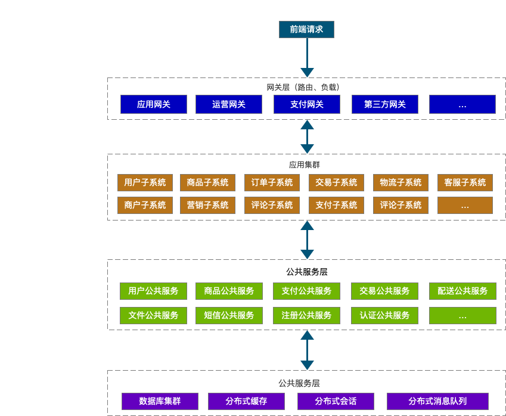
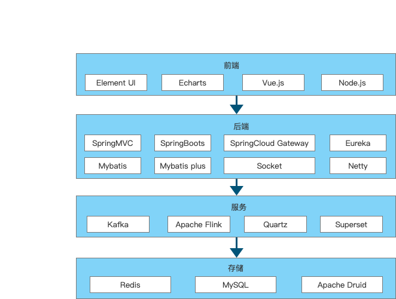
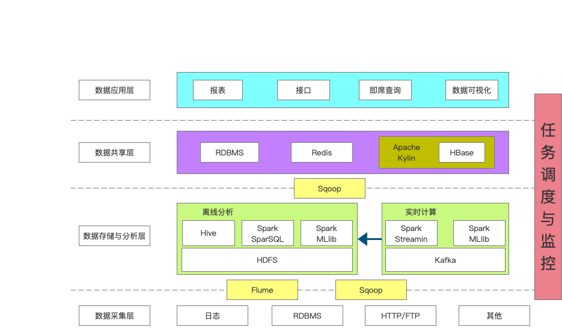

# 1 业务架构
使用者：CEO，CIO，CTO，产品总监

## 核心能力

## 全局视图

# 2 功能架构

## 示例：黑马头条功能架构图

# 3 系统架构

使用者：系统架构师

# 4 技术架构

使用者：系统架构师

还可参见其他软件的技术架构图来进行学习；

# 5 数据架构

使用者：CTO、系统架构师、数据架构师

也就是，数据库设计

## 实例：大数据平台架构

# 6 部署架构

使用者：运维架构师

