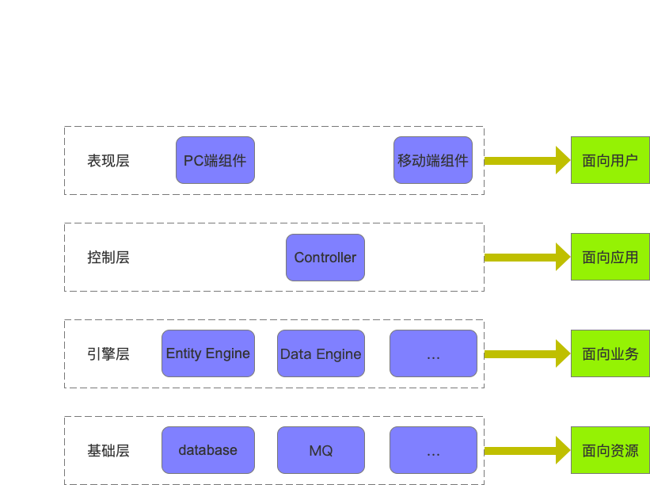

# 1 解耦
耦合指的就是对象之间的依赖性，对象之间的耦合度越高，维护成本就越高，因此对象的设计应使类和构件之间的耦合最小。软件设计中通常用**耦合度**和**内聚度**作为衡量模块独立程度的标准。划分模块的一个准则就是高内聚低耦合。

降低耦合度就是解耦，在设计上解耦的核心思想就是**彼此独立，互不依赖**

# 2 分层

封层结构是最流行、应用最广泛的应用软件的设计方式，在应用了封层结构的系统中，各个子系统按照层次的形式组织起来，上层使用下层的各种服务，而下层对上层一无所知，每一层都对自己的上层隐藏其下层的细节。

**经典三层架构**
用户界面层->业务逻辑层->数据访问层->数据库

本质上都是一个单体架构的数据库管理系统，有效的隔离了业务逻辑与数据访问逻辑，使得这两个不同关注点能够相对自由和独立地演化。

**设计原则**
保证同一层的组件处于同一个抽象层次，即所谓的“单一抽象层次原则”。

# 3 封装
假设我们有一个程序，它在逻辑上又一些不同的对象，并且这些对象彼此之间会相互交流。

在一个类中，当每个对象的状态保持相对独立，就实现了封装。其余的对象并不能观察到这个对象的状态，他们能做到的只有调用一些被称作“方法”的通用功能。

因此，对象使用方法掌握着自己的状态，除非明确允许，没有其他人可以接触到它，如果你想和某个对象交流，你需要使用提供的方法。但在默认情况下，你无法改变对象的状态。

