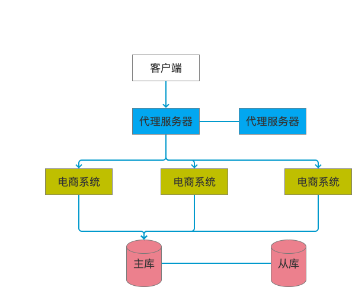
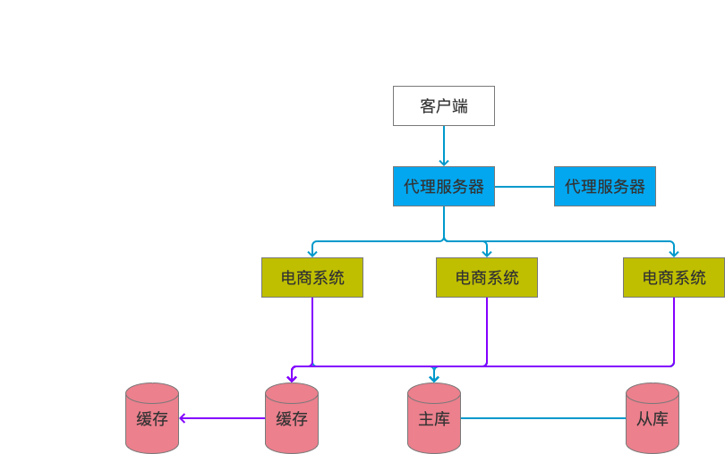
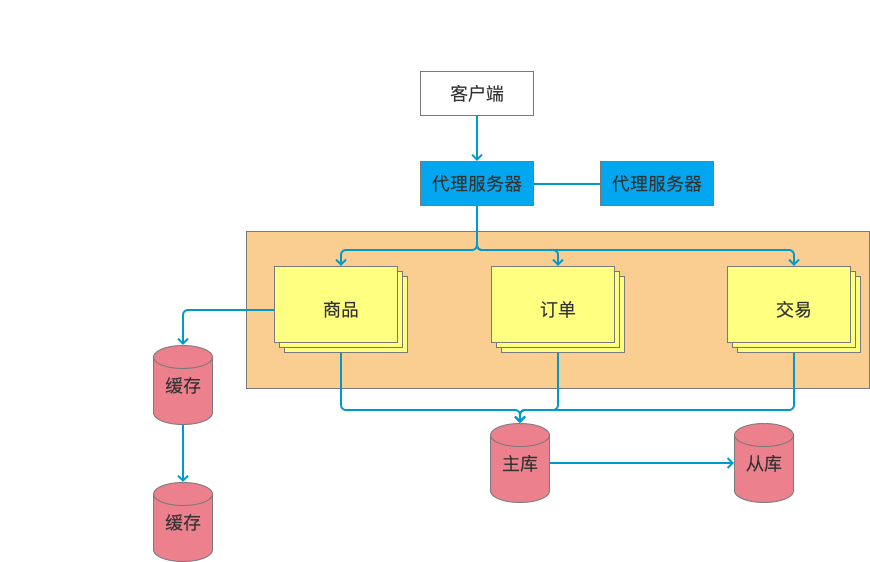
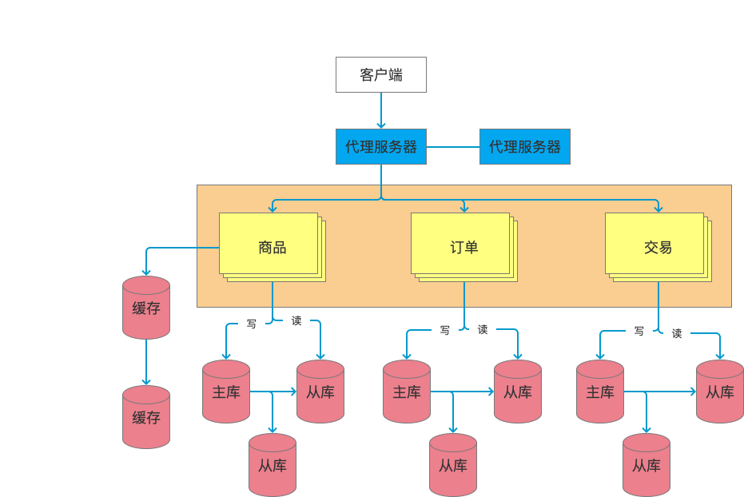
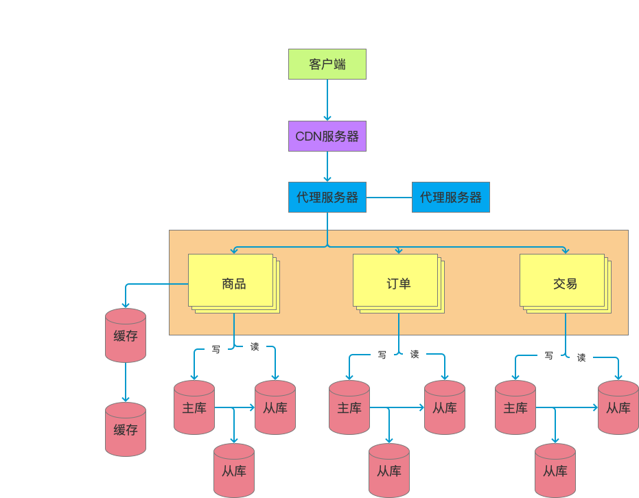
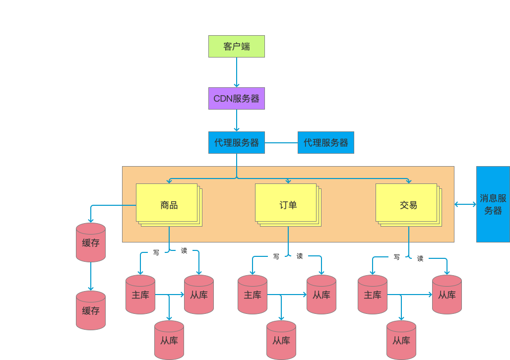
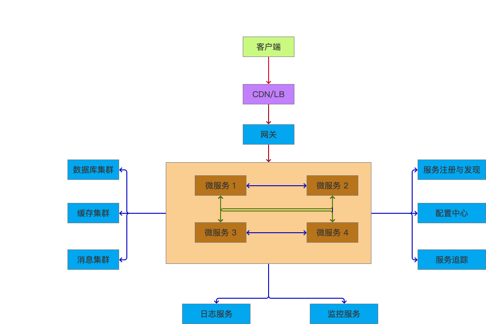

# 1, 单体架构
背景：公司发展初期，资金少，用户少，数据和并发量小

硬件特点：单一服务器

详情：   
- 操作系统：windows、 linux
- 应用服务器：tomcat、jetty、jboos、apache、weblogic、websphere
- 数据库：mysql、oracle、db2
- 应用系统：java、php、asp等
  
优点：   
- 节省服务器资源，投入少；
- 管理简单：上线、部署、监控、问题排查等都比较简单；
- 开发简单：软件系统功能都整合在一起，不需要考虑太多服务依赖等问题，代码管理也简单明了；
- 测试简单

缺点：   
- 可用性差：应用和数据库都是单点，无论应用还是数据库出现问题，整个系统就会不可用了；
- 稳定性差：系统耦合度高，新增或者修改任何一个功能，哪怕只是一行代码，也需要重启服务器，此时系统是不可用的；
- 性能差：单一的应用服务器和数据库服务器，性能总会有上限的，当用户变多或者准确的说并发量增大时，系统很容易挂掉；

多方的考验（架构本身的不足）：       
**用户要求**    
- 高可用：随时能访问
- 高性能：系统不能慢   
**业务要求**   
- 需求多
- 变更快
- 发布频繁    
**客观条件**   
- 用户多、分布广
- 海量数据
- 网络情况复杂
- 安全环境恶劣

# 2 分布式架构

定义：多个实例提供服务

## 2.1 应用集群

- 反向代理服务器：把用户请求反向路由到应用服务器，常见的反向代理服务器是Nginx或HAProxy
- 应用服务器：集群化部署
- 数据库服务器：主从部署

**架构优点**   
- 可用性高：代理服务器、应用服务器、数据库服务器都是做了集群，当某台机器挂掉后，其他机器能够几乎无感的接下任务
- 性能比单体架构高：用户的请求分发到多个应用服务器上，整体性能接近单体结构的三倍
- 安全性高：外网用户访问的是反向代理服务器，应用和数据库隔离在内网中

## 2.2 分布式缓存

多级缓存，本地缓存（JVM等），分布式缓存服务器（Redis等）

## 2.3 业务拆分

业务进一步发展，用户越来越多，系统出现了瓶颈，此时可以对电商系统做进一步的拆分，分为水平拆分和垂直拆分

**水平拆分**   
拆分成商品、订单、交易、用户、支付等多个系统，每个系统都是多台服务器构成的集群

**垂直拆分**    
将一些公共业务和服务，如用户中心拆分成注册登录中心和用户中心，短信、文件、消息等各种公共服务，从业务系统中拆分出来

**优势**    
- 应用系统增加了，能响应更多的用户请求；
- 公共服务能够提供给所有的应用使用，可达到服务复用的效果；

## 2.4 分库分表和读写分离

**读写分离**    
主库：增删改，主要是写操作
从库：查，主要是读操作

**分库分表**    
产生背景：数据越来越多；单库发生意外情况；

性能会显著提高，但是管理和维护成本也很高；

## 2.5  静态化和CDN

背景：网站业务规模增大，用户数增多，在不同的网络环境下，速度差别也太大；为了提供更好的用户体验

操作上，将一些商品页面在发布时做静态化，静态化页面和资源可以放在CDN服务器，部署在网络提供商的机房，用户在访问时可以有效利用CDN的有点，从距离最近的网络提供商机房获取数据

## 2.6 异步解耦

应用之间的服务存在相互调用的情况，但有些可拆分为异步调用，增强业务系统的性能，也可以减少服务之间的依赖

# 3 微服务架构

微服务架构是分布式架构的深化，分布式架构偏向于部署和环境，比如应用、数据库、缓存等，在多台机器上进行部署，就属于分布式。

微服务架构通过**业务拆分**实现服务组件化，通过组件组合快速开发系统，业务单一的服务组件又可以独立部署，使整个系统清晰灵活。

**背景：**    
大量的分布式服务回让架构面临新的问题，如服务注册发现，服务统一接入和权限控制，服务的负载均衡，服务配置的集中管理，服务熔断，服务监控等。

**微服务架构的组成：**       
- 服务注册发现组件：进行服务治理
- 服务网关组件：提供统一入口和权限控制
- 负载均衡组件：提供客户端或服务器端的负载均衡
- 集中配置组件：提供服务集中管理
- 熔断器组件：提供服务熔断
- 服务追踪组件：提供服务监控

**优点：**    
可以快速迭代和交付

**缺点：**      
额外工作量，如服务注册，服务发现，服务通讯，负载均衡，服务熔断，服务超时等；   
额外需要的第三方库：Hystrix, Eureka, Zookeeper等

